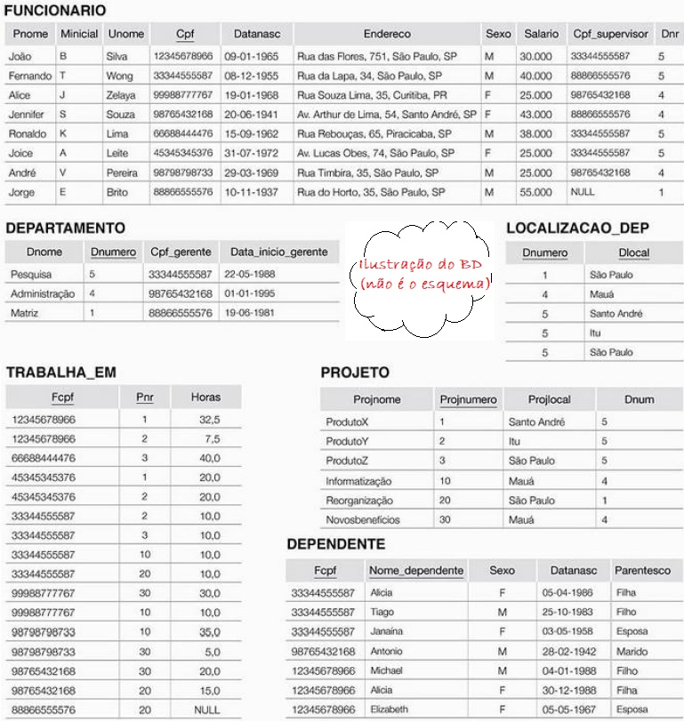

## [Tópico T15] - Álgebra Relacional - Vários comandos
###### *by Prof. Plinio Sa Leitao-Junior (INF/UFG)*

Seja abaixo uma [*ilustração para o banco de dados*](../media/fig-mr-2.jpg) **BD Empresa** [1], conforme Modelo Relacional (MR):

### Grupo 1: Fácil

1. π Pnome, Unome (FUNCIONARIO)
1. σ Sexo="F" (FUNCIONARIO)
1. π Pnome, Unome ( σ Sexo="F" (FUNCIONARIO) )
1. TRABALHA_EM  X  PROJETO
1. ρ FUNC ( π Pnome, Unome ( σ Sexo="F" (FUNCIONARIO) ) )
1. ρ FUNC (PrimeiroNome, UltimoNome) ( π Pnome, Unome ( σ Sexo="F" (FUNCIONARIO) ) )

### Grupo 2: Simples

1. TRABALHA_EM &#8904; Fcpf=cpf  FUNCIONARIO
1. FUNCIONARIO * ( ρ (cpf, Projnumero, Horas) (TRABALHA_EM) * PROJETO )
1. π Cpf_supervisor (FUNCIONARIO) ∪ π Cpf_gerente (DEPARTAMENTO)
1. π Cpf_supervisor (FUNCIONARIO) ∩ π Cpf_gerente (DEPARTAMENTO)
1. π Cpf_supervisor (FUNCIONARIO) – π Cpf_gerente (DEPARTAMENTO)
1. SUP_E_GER ← ρ (cpf) ( π Cpf_supervisor (FUNCIONARIO) ∩ π Cpf_gerente (DEPARTAMENTO) ) RESP ← π Pnome, Unome ( FUNCIONARIO * SUP_E_GER )
1. π Cpf, Pnome (FUNCIONARIO) ∩ π Fcpf, Nome_dependente (DEPENDENTE)
1. SUP_SEM_DEP ← ρ (cpf) ( π Cpf_supervisor (FUNCIONARIO) – π Fcpf (DEPENDENTE) ) RESP ← π Pnome, Unome ( FUNCIONARIO * SUP_SEM_DEP )

### Grupo 3: Motivador

1. ℑ CONTA cpf , MÉDIA Salario, MÁXIMO Salario , MÍNIMO Salario (FUNCIONARIO)
1. Dnr ℑ CONTA cpf , MÉDIA Salario, MÁXIMO Salario , MÍNIMO Salario (FUNCIONARIO)
1. ρ RESUMO (Dnumero, QtdeFunc, MediaSalario) Dnr ℑ CONTA cpf , MÉDIA Salario (FUNCIONARIO) RESPOSTA ← π Dnome, QtdeFunc, MediaSalario ( DEPARTAMENTO * RESUMO )
1. ρ SUPERVISOR (π Cpf, Pnome (FUNCIONARIO) ) FUNCIONARIO &#8904; FUNCIONARIO.Cpf_supervisor = SUPERVISOR.Cpf SUPERVISOR
1. ρ SUPERVISOR (Cpf_supervisor, Pnome_supervisor) (π Cpf, Pnome (FUNCIONARIO) ) π Pnome, Pnome_supervisor (FUNCIONARIO * SUPERVISOR ) 

### _Under Construction_
